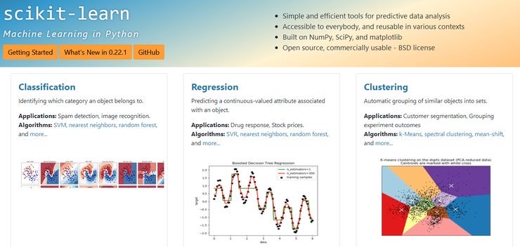

# The-latest-AI-learning-framework-for-2020
[包含了44个顶级开源项目，涵盖了11类AI学习框架、平台](https://github.com/haggaishachar/techmap)
## 目录：

Ⅰ、经典机器学习（1-3）

Ⅱ、深度学习（4-8）

Ⅲ、强化学习（9-12）

Ⅳ、自然语言处理（13-18）

Ⅴ、语音识别（19-21）

Ⅵ、计算机视觉（22-26）

Ⅶ、分布式训练（27-31）

Ⅷ、自动建模（32-35）

Ⅸ、IDEs系统（36-38）

Ⅹ、平台（39-41）

Ⅺ、评分推理系统（42-43）

### Ⅰ、适用于经典机器学习的工具

**一、Scikit-learn star 39.2k fork 19.2k**

scikit-learn是一种强大的基于Python语言的机器学习算法库(https://scikit-learn.org/stable/) 。其中，包含了算法预处理，模型参数优化，回归和分类等算法，官方文档包含了每一种算法等例子，代码简洁优美，可视化了每一种算法结果，即能学习python，也是帮助开发者更好理解机器学习算法的便利工具

尤其在监督学习部分，Scikit-learn提供了广义线性模型、支持向量机、最近邻算法、高斯过程、朴素贝叶斯、决策树和集成方法等算法教程，同时还介绍了特征选择、随机梯度下降算法、线性与二次判别分析等在监督学习中非常重要的概念；而在半监督学习中的标签传播算法和无监督学习中的聚类和降维算法方面，也有非常多的教程。

GitHub地址:
https://github.com/scikit-learn/scikit-learn

**二、XGBoost star 18.3k fork 7.3k**

xgboost的全称是extreme gradient boosting，它在Gradient Boosting框架下实现了c++机器学习算法。
XGboost最大的特点在于，它能够自动利用CPU的多线程进行并行，同时在算法熵加以改进，提高了精度。他是经过优化的分布式梯度提升库，可拓展性强，高效、灵活且可移植。

GitHub地址:
https://github.com/dmlc/xgboost
